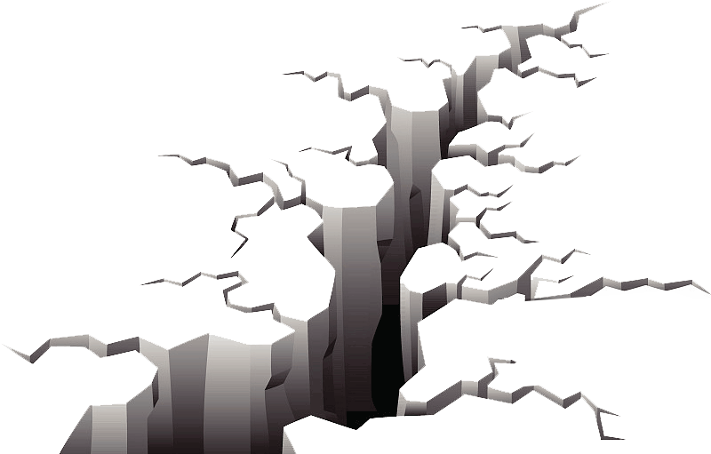

# Zelzele App

Try here 👉: https://share.streamlit.io/dogudogru/zelzele/main
 
 
<h3> <b>Turkey Earthquake Dashboard</b> - Displays the last 500 earthquakes happened in Turkey on different maps and charts. </h3>

***

In Turkey, earthquakes are nothing out of the ordinary with thousands of tremors taking place all over the country. There is a well-known saying in Turkish Coğrafya kaderdir which means Geography is destiny and it perfectly describes Turkey's proneness to earthquakes.

The Anatolian transform fault system is probably the most active in the world. It separates the Eurasian plate from the Anatolian plate in northern Turkey.

Some of the most destructive earthquakes in history have been caused by movement along this fault. Lake Hazar lies along the East Anatolian transform fault.

***

<h2>Project Steps </h2>

1) Scrape the last 500 recorded earthquake information from <a href="http://www.koeri.boun.edu.tr/scripts/lasteq.asp">KOERI's website</a></href>

2) Convert text data into dataframe using Pandas dataframe manipulation techniques and use st.cache  function.

3) Prepare map functions via Plotly Express

4) Construct the layout for the Streamlit App. 

***

<h3>🛡️ This Streamlit data app is designed by : </h3>
 

<h2>🔭Dogukan Dogru</h2>

 

📱

